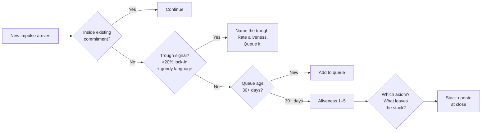
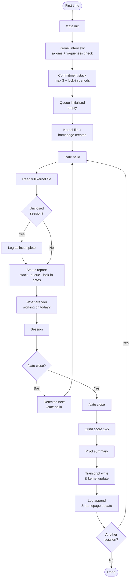
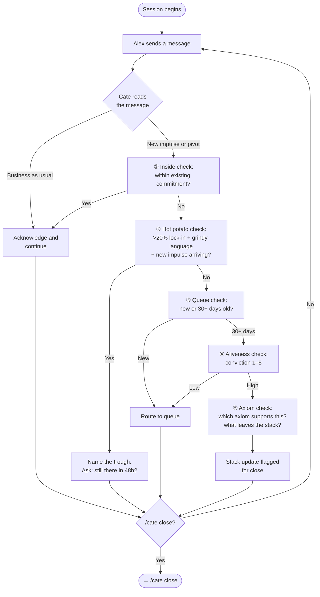

# Cate — Commitment Guardian

A Claude Code skill that acts as an axiom anchor and pivot interrogator. Cate holds a kernel of your values and commitments, gates new impulses through a structured queue, and runs a fixed interrogation before any pivot. It never prevents you from changing direction — it makes sure you're doing it for the right reasons.

Forked from [Dave](https://github.com/alex-is-learning/dave) / [Virgo and Fiona](https://github.com/alex-is-learning/virgo-and-fiona).

---

## Philosophy

**The problem isn't that you pivot. It's that you pivot before you've diagnosed why.**

New ideas arrive with the feeling of aliveness. But that feeling looks identical whether the idea is genuinely better or whether you've hit the trough — the grindy phase past the first 20% of a commitment where novelty has worn off and the work gets hard. Cate distinguishes the two.

The **kernel** is the stable core: your axioms (beliefs about what matters), your commitment stack (max 3 active), your queue (where new impulses wait), and lock-in periods (minimum durations before reassessment). Cate never changes the kernel mid-session — it only appends at close.

The **five-step interrogation** runs every time something new is proposed:

1. **Inside check** — is this within an existing commitment?
2. **Hot potato / trough check** — past 20% of lock-in, grindy language, new impulse arriving?
3. **Queue check** — new impulse or 30+ days old?
4. **Aliveness check** — conviction rated 1–5
5. **Axiom check** — which axiom supports this? What leaves the stack to make room?



---

## Commands

| Command | Purpose |
|---|---|
| `/cate init` | One-time setup: kernel interview, axiom elicitation, commitment stack, queue, lock-in periods, vault scaffold |
| `/cate hello` | Session entry: context load, early exit check, status report of stack / queue / lock-in dates |
| `/cate close` | Session close: grind score, pivot summary, transcript write, kernel update, log append, homepage update |
| *(in-session)* | Pivot interrogation, trough detection, queue routing, aliveness check, axiom anchoring |

---

## How It Works

### Session flow



### In-session interrogation

Cate runs the same five-step sequence for every proposed pivot or new impulse. The sequence is fixed — it cannot be reordered or shortcut:



### The kernel

`Cate Kernel.md` is the persistent state file. It has five fixed H2 sections:

- **Axioms** — stable beliefs about what matters; elicited at init with vagueness checks
- **Commitment Stack** — max 3 active commitments, each with a lock-in period and end condition
- **Queue** — new impulses waiting; items 30+ days old surface for review
- **Lock-In Periods** — minimum durations per commitment before reassessment
- **Kernel History** — append-only dated blocks recording all changes

Kernel updates are never made mid-session. Every change is written as a dated append block at close.

---

## Vault Structure

```
~/scrapbook_private/source/content/Cate/
├── Alex and Cate.md          ← Homepage (session index)
├── Cate Kernel.md            ← Axioms, stack, queue, lock-in periods, history
├── sessions/
│   └── YYYY-MM-DD-cate-session-N.md
└── log/
    └── YYYY-MM-DD-cate-log.md
```

`scrapbook_private` — never published.

---

## Skill Files

```
~/.claude/skills/cate/  →  ~/claude/cate/skills/cate/
```

```
skills/cate/
├── SKILL.md
├── workflow.md          # Persona, hard constraints, kernel schema, dispatch
└── steps/
    ├── step-init.md     # /cate init
    ├── step-hello.md    # /cate hello
    ├── step-session.md  # In-session interrogation
    └── step-close.md    # /cate close
```

---

## Technical Design

- **Incremental append writes** — every turn appended via bash heredoc immediately. Crash-safe. No read-then-write.
- **Transcript held at close** — session transcript is held in context during the session and written as a single heredoc at `/cate close`. Mid-session, nothing is written to the transcript file.
- **awk exception for homepage** — the session index table requires row insertion rather than append; uses awk + temp file swap.
- **Hardcoded vault path** — `~/scrapbook_private/source/content/Cate/` defined once in `workflow.md`. Never derived at runtime.
- **Fixed interrogation sequence** — the five steps are enforced at the skill level, not subject to conversational negotiation.
- **Max 3 commitments** — hard constraint. Stack update requires naming what leaves before anything enters.
- **Early exit detection** — if a session ends without `/cate close`, the next `/cate hello` detects it, logs the incomplete session, and surfaces a continuity note.
- **Frontmatter + backlink scan at close** — patches any session file missing `date`/`tags` frontmatter or `[[Alex and Cate]]` backlink.

---

## Project Artefacts

Design and planning documents in `_bmad-output/`:

| File | Contents |
|---|---|
| `prd-cate.md` | Full PRD — 33 functional requirements, 15 non-functional requirements |
| `architecture-cate.md` | Architecture decisions — write mechanisms, kernel strategy, data flow |
| `product-brief-cate.md` | Original product brief |

---

## Status

Skill files complete and installed via symlink. Vault directories created. Next: `/cate init` first real session.
